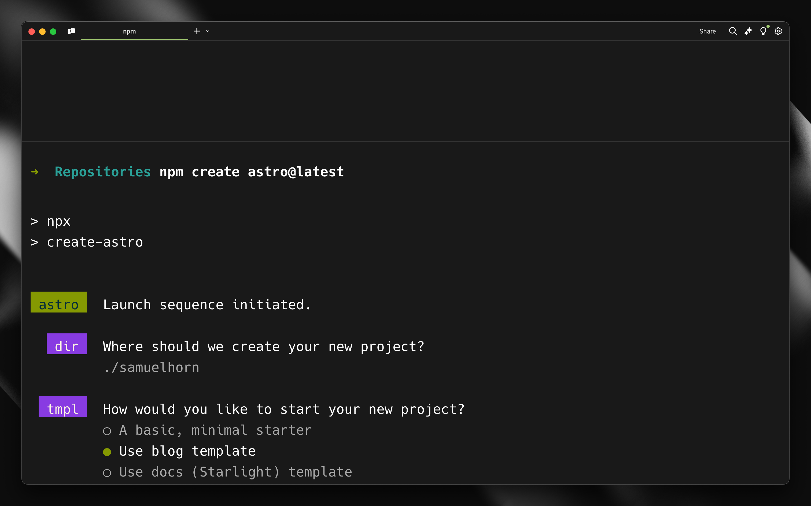
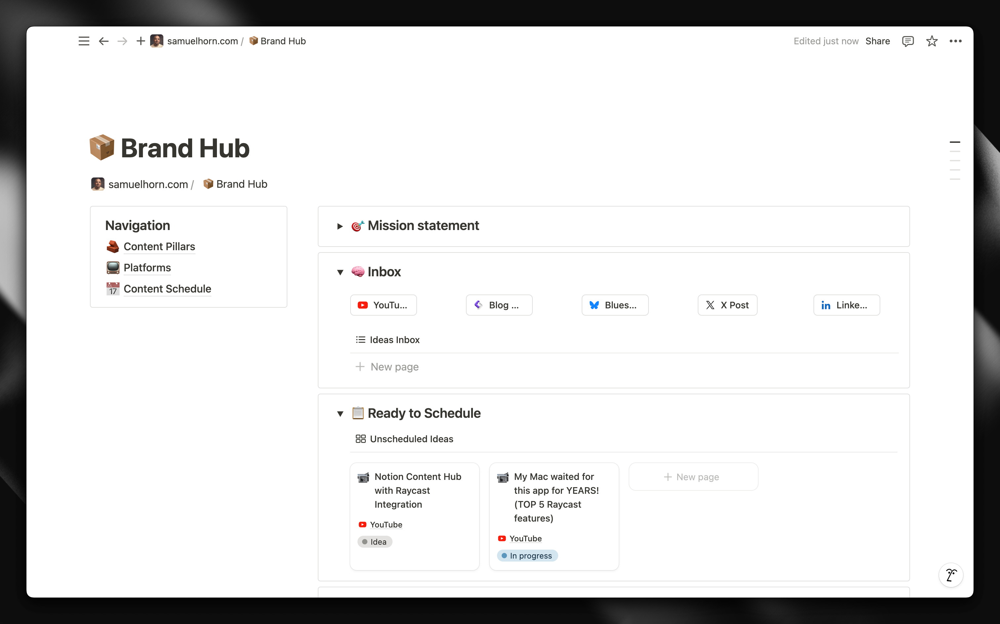
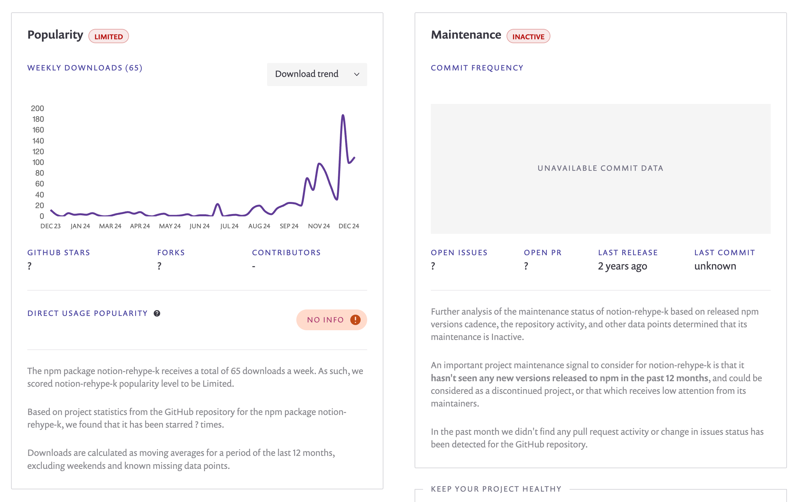

<Callout>
## Disclaimer
Since writing this post, I've encountered issues with the Notion integration, particularly with handling Notion's presigned image URLs. I've considered solutions like intercepting the image requests and passing them to a Cloudflare worker to store them somewhere else.

However, I believe that approach is too advanced for a simple blog. For now, I'm returning to using markdown files for my blog posts. I'll keep an eye on the Notion integration and may revisit it in the future.
</Callout>

<Callout style="secondary">
## TL;DR
- How to set up Astro 5 with Notion as a content source
- Working solutions for common Notion integration challenges
- A performant approach to embedding YouTube videos
- Practical workarounds using patch-package for quick deployment
</Callout>

## Why I’m finally committing to my blog in 2025

December 2024 marks a turning point in my content creation journey. After five attempts at building a blog—each time getting caught in the familiar developer trap of enjoying the build more than the writing—I'm finally approaching it differently.

What's changed? This time, I'm combining my love for building with a clear content strategy that spans both written and video content. In this post, I'll walk you through how I built this blog using Astro 5 and Notion, sharing both the technical details and the practical solutions I discovered along the way.

## Why Astro is perfect for content-focused websites

Let me quickly catch you up on Astro - though many of you are probably familiar with it already. a framework built specifically for content-focused websites like blogs and landing pages, rather than JavaScript-heavy applications. Astro's been doing some interesting work pioneering new concepts, including the [island architecture](https://docs.astro.build/en/concepts/islands/). If you're new to all this, here's a video that covers the basics really well:

<YouTube id="XRe560_vVF0" caption="Astro deep dive by Code to the Moon" />

## Why Astro and not Next.js or something else I’m familiar with

When it came to choosing a framework for my blog, I wanted something that felt lightweight, fast, and purpose-built for content. Sure, I’ve spent years working with both Vue and React, in frameworks such as [Nuxt.js](https://nuxt.com/) and [Next.js](https://nextjs.org) and could probably set up a site in my sleep, but it felt like overkill for a blog. I didn’t need all the bells and whistles of a full app framework—just a solid foundation to showcase content with as little hassle as possible. Plus, let’s be honest, Astro has been getting a lot of hype in the developer community lately, and I couldn’t resist the chance to see what all the excitement was about.

Now that we've covered why Astro made sense for my use case, let's dive into the actual implementation.

## Starting the build: first steps with Astro

I decided to install Astro to give it a try. Shortly after running `npm create astro@latest`, I discovered that I could start from templates. Using the blog template seemed like a good idea.




After installing the blog template, I was pleased to discover that it utilized local markdown files for content, just as I had hoped. Markdown is an excellent format for writing blogs, especially for developers, as it allows you to easily commit your content alongside your code. While it feels a bit strange to don’t use a CMS—especially since I work for Prismic, which is a CMS—I believe it makes a lot of sense for a developer blog, where the content will only be added by one tech-savvy user that might not need an intuitive interface. Additionally, by using the Content Collections in Astro, I can take advantage of Intellisense and type checking in my editor, ensuring automatic TypeScript type safety for all content which is very cool.

## Exploring Astro’s content layer and loaders

Just as I was fiddling with my markdown files, I was considering where to store all the images. Should I store them with the code, or use a [DAM](https://docs.astro.build/en/guides/media/) like [Imgix](https://www.imgix.com/) or [Cloudinary](https://cloudinary.com/)? During this process, I discovered something interesting in the documentation.

> However, what caught my eye was the ability to use community-built loaders or create my own custom loaders to pull data from any source.

Since version 5, which is quite recent, Astro has introduced a [Content Collections API](https://docs.astro.build/en/guides/content-collections/) for defining and querying content collections. This API leverages built-in loaders for local content, such as Markdown. However, what caught my eye was the ability to use community-built loaders or create my own custom loaders to pull data from any source.

I noticed that a community loader for [Notion](https://notion.se) already exists. While I initially considered creating a blog using Markdown, the idea of having my posts in the same place where I brainstorm and plan the rest of my content was too appealing to ignore. I had to explore this further.



So, I began with creating a simple Notion integration over at https://www.notion.so/profile/integrations, then I created a database in Notion to hold my blog posts, and added the integration to that database.

Next, setting up the Notion Astro Loader is as simple as installing it with `npm i notion-astro-loader` , and then configuring it like below, using my newly created integrations token together with the ID of the database.

```ts src/content.config.ts
import { defineCollection, z } from "astro:content";
import { notionLoader } from "notion-astro-loader";
import {
  notionPageSchema,
  propertySchema,
  transformedPropertySchema,
} from "notion-astro-loader/schemas";

const blog = defineCollection({
  loader: notionLoader({
    auth: import.meta.env.NOTION_TOKEN,
    database_id: import.meta.env.NOTION_DB_ID,
    filter: {
      property: "published",
      checkbox: { equals: true },
    },
    schema: notionPageSchema({
      properties: z.object({
        Name: transformedPropertySchema.title,
        created: propertySchema.created_time.optional(),
        tags: transformedPropertySchema.multi_select,
        slug: transformedPropertySchema.rich_text,
      }),
    }),
  }),
});

export const collections = { blog };
```

I filter the collection to include only posts with the `published` property checked in Notion. This worked well, and I successfully pulled my sample posts into the Astro blog. Once I confirmed that everything was functioning, I added additional properties that I knew I would need later. In my Notion database for blog posts, I included properties for `created` (created time property), `tags` (multi-select property), and `slug` (text property).

As shown in the collection definition above, I also use the provided `notionPageSchema` to specify which properties to include in my collection, while also transforming some to get cleaner data.

While the initial setup was straightforward, I soon discovered that integrating Notion would require some creative problem-solving.

## Overcoming challenges with the Notion integration

At this point, I had only created some sample posts that included the post title and all the properties mentioned above, allowing me to list a couple of posts. Armed with my basic setup, I began the real test: creating my first full blog post in Notion. What seemed straightforward at first quickly revealed some interesting challenges that needed solving.

### Problem 1: Callouts not appearing

Structured text, images, and headings worked very well. My first issue arose when I tested the callout. Adding a callout in Notion resulted in nothing appearing in the blog post. However, when I included an icon in the Notion callout, it showed up in the blog post.

I began searching within `notion-astro-loader` to identify where the content was transformed. I found the answer in `./node_modules/notion-astro-loader/dist/render.js` It utilizes a rehype plugin called `notion-rehype-k` to parse the Notion blocks into a rehype AST.

```js
...
import notionRehype from "notion-rehype-k";

const baseProcessor = unified()
    .use(notionRehype, {}) // Parse Notion blocks to rehype AST
    .use(rehypeSlug)
    .use(rehypeKatex)
    .use(rehypeStringify)
```

Upon researching notion-rehype-k, it seemed quite inactive. However, its popularity has risen over the past month, possibly due to notion-astro-loader .



I started to explore this plugin and found the file responsible for callouts.

```js node_modules/notion-rehype-k/dist/handlers/callout.js
import { addTasksToAddRichTexts } from "./rich-text.js";
import { addTasksToAddDirectChildren } from "./children.js";
import {
  h,
  getColorClassName,
  getNotionFileUrlAndAttr,
  notionPrefixFactory,
  hasChildren,
} from "../utils.js";
import { BlockType } from "../types.js";
const handler = (context, block) => {
  const data = block[BlockType.callout];
  const blockClass = notionPrefixFactory(context)(BlockType.callout);
  const calloutIcon = h("div", { className: [`${blockClass}-icon`] }, []);
  if (data.icon.type === "emoji") {
    calloutIcon.children.push(h("text", data.icon.emoji));
  } else {
    const { url, attr: fileAttr } = getNotionFileUrlAndAttr(context, data.icon);
    calloutIcon.children.push(h("img", { src: url, ...fileAttr }, []));
  }
  const calloutContent = h("div", { className: [`${blockClass}-content`] }, []);
  addTasksToAddDirectChildren(context, calloutContent, data.children);
  addTasksToAddRichTexts({
    context,
    block,
    hast: calloutContent,
    richTexts: data.rich_text,
    wrapRichTexts: hasChildren(data),
  });
  const className = [blockClass];
  const colorClassName = getColorClassName(data.color);
  colorClassName && className.push(colorClassName);
  const hast = h("section", { className }, [calloutIcon, calloutContent]);
  return hast;
};
export default handler;
```

The problem is that it tries to push content to calloutIcon, even though it might not be present. This was simply fixed by adding an if statement around rows 9-15, like this:

```js
...
if (data.icon) {
		if (data.icon.type === 'emoji') {
				calloutIcon.children.push(h('text', data.icon.emoji));
    } else {
        const { url, attr: fileAttr } = getNotionFileUrlAndAttr(context, data.icon);
        calloutIcon.children.push(h('img', { src: url, ...fileAttr }, []));
    }
}
...
```

Knowing in the back of my mind that editing an npm package like this is not advisable, I continued searching for other issues and quickly found a couple.

With the callout issue resolved, I turned my attention to the next challenge.

### Problem 2: Videos error due to just embedding an iframe

For instance, the video embeds attempted to insert an iframe with the YouTube video URL in the src attribute, which YouTube doesn’t allow. This resulted in an error on the blog front end.

First, I fixed it to create a standard YouTube embed, which worked on the front end. However, since Astro is highly performant by default, I felt it was unnecessary to bloat the code with heavy YouTube embeds. Instead, I developed a more efficient solution. Since I would only be embedding YouTube videos, I modified the file responsible for converting the video embeds to this:

```js .node_modules/notion-rehype-k/dist/handlers/video.js
import { addCaptionToHast } from "./caption.js";
import { h, notionPrefixFactory } from "../utils.js";
import { BlockType } from "../types.js";
const handler = (context, block) => {
  const data = block[BlockType.video];
  const videoUrl = new URL(data.external.url);

  if (videoUrl.hostname !== "www.youtube.com") {
    return null;
  }

  const videoId = videoUrl.searchParams.get("v");
  const blockClass = notionPrefixFactory(context)(BlockType.video);
  const hast = h("div", { className: [blockClass] }, [
    h("button", { dataVideoId: videoId, ariaLabel: "Play video" }, [
      h(
        "img",
        { src: `https://img.youtube.com/vi/${videoId}/maxresdefault.jpg` },
        []
      ),
    ]),
  ]);

  addCaptionToHast(context, hast, data.caption);
  return hast;
};
export default handler;
```

This outputs a button with the YouTube thumbnail. I have some JavaScript on the front end that replaces the screenshot with a playing video when clicked. This method works well on a static blog, as the video only loads when a visitor clicks it.

## A temporary solution: patching the Notion loader

I found more fixes that I needed to make for other block types. Soon, I was rewriting a significant part of the `notion-rehype-k` package.

I began to consider my options:

1. Solve all the issues with `notion-rehype-k` and submit a pull request. However, I doubt it would be merged anytime soon due to interactivity. Additionally, I would only be fixing errors without adding any opinionated output, as shown in the video above.
2. Create a new rehype package for converting Notion blocks AST and submit a pull request to `notion-astro-loader` to switch to my package. I decided against this because I felt my AST output was too opinionated, using the video above as an example.

Since I wanted to publish this blog quickly, I felt neither of these solutions was suitable for now. Instead, I continued modifying the package's code as I had before. I then patched it by installing `patch-package` and running `npx patch-package notion-rehype-k`. Finally, I set up a post-install script to run `patch-package` which would then apply this patch each time the package is installed, like this:

```json package.json
...
"scripts": {
    "dev": "astro dev",
    "build": "astro build",
    "preview": "astro preview",
    "astro": "astro",
    "postinstall": "patch-package" // apply patches
},
...
```

I know it’s not a good long term solution, but it gets me where I need for now. If `notion-astro-loader` gains good momentum, I might create my own optinionated rehype plugin that can be used with it, for performant static Notion output.

## Next steps and future improvements

While my current setup with the patched Notion loader works well enough to launch the blog, there's definitely room for improvement. Here's what I'm planning to work on next:

1. Create a more sustainable solution for handling Notion blocks, possibly through a dedicated rehype plugin
2. Implement better image optimization for Notion images

## Conclusion

Despite the challenges with the Notion integration, I'm really happy with how this setup turned out. Astro 5 provides an excellent foundation for a performant blog, and using Notion simple blog post content gives me the flexibility to write and organize content where I already do most of my planning.

The ability to write posts in Notion, complete with rich formatting and embedded content, while maintaining the performance benefits of a static site, makes this setup particularly appealing. Yes, there were some hurdles to overcome with the Notion integration, but the end result is exactly what I was looking for - a lightweight, fast blog that's easy to maintain and update.

If you're interested in the technical details or want to see how I implemented specific features, you can find the source code for this blog on my [GitHub repository](https://github.com/samuelhorn/samuelhorn.com). Feel free to use it as inspiration for your own projects!
