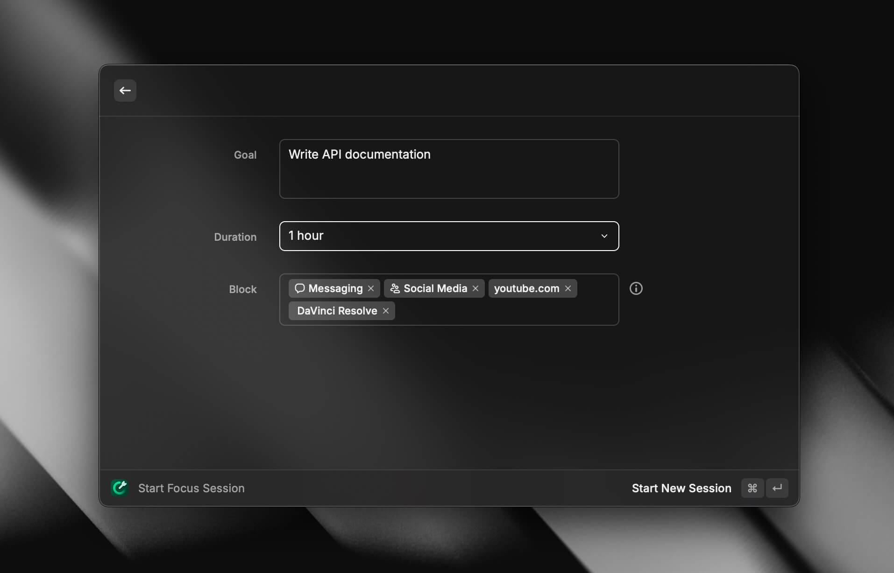
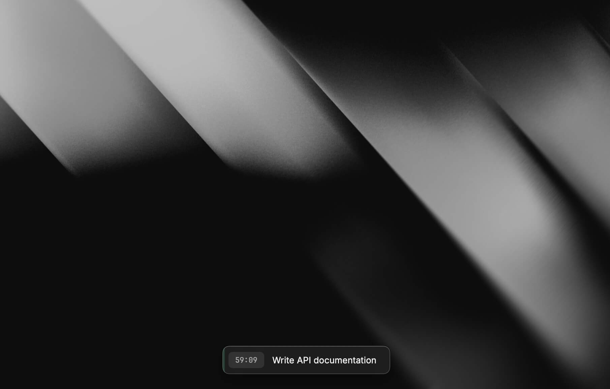
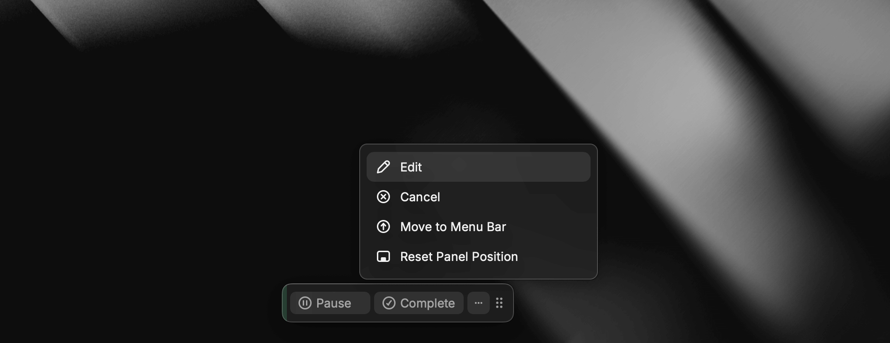
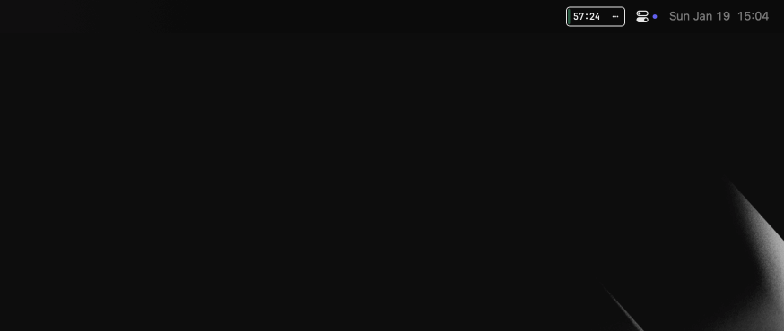

As a developer and content creator, I've been using Raycast as my go-to productivity tool for the past 2 years. It has transformed my workflow by providing quick access to apps, window management, calculations, and AI capabilities. But even with these powerful features, there's one productivity killer that affects all of us: context switching.

<Callout>
📺 **Want to see Raycast Focus in action?** Check out my video walkthrough of Raycast Focus:
</Callout>

<YouTube id="DCoj7oSVxaQ" caption="Astro deep dive by Code to the Moon" />

> "We lose about 40% of our productive time to context switching. That's almost half of your workday gone just from jumping between tasks and getting distracted."

## The Hidden Cost of Context Switching

Did you know that we lose about 40% of our productive time to context switching? That's almost half of your workday gone just from jumping between tasks and getting distracted. If you're like me, you've probably experienced those moments where you're deep in code or writing, and suddenly you find yourself doom-scrolling on social media.

The real problem isn't just the time spent on distracting apps – it's the mental overhead of switching contexts. Research shows that it takes an average of 23 minutes to fully regain focus after an interruption. In our connected world, these interruptions are constant:
- Slack notifications pulling you out of deep work
- The temptation to "quickly check" Twitter
- YouTube recommendations when you're researching a coding problem
- Chat messages that seem urgent but aren't

## Introducing Raycast Focus: More Than Just App Blocking

This week, Raycast launched a [powerful new feature](https://www.raycast.com/core-features/focus?via=samuelhorn) designed to tackle this exact problem. Focus helps you stay in the zone by blocking distracting apps and websites during your work sessions. But it's more than just another website blocker – it's an integrated part of your productivity workflow.

### Why Raycast Focus is Different
Unlike standalone focus apps, Raycast Focus integrates seamlessly with your existing workflow:
- Trigger it instantly with custom shortcuts
- Maintains Raycast's minimal, elegant design
- Blocks both apps and websites in one place
- Keeps you accountable with clear, non-intrusive reminders when breaking the rules

## Setting Up Your Perfect Focus Session

### 1. Defining Your Goal
The first step in any Focus session is setting a clear intention. This isn't just a checkbox feature – it's a powerful psychological tool. When you write down "Write API documentation" instead of just "Work," you're creating a clear contract with yourself.

Some effective goal examples:
- "Complete user authentication flow"
- "Write blog post introduction"
- "Review and respond to PR comments"
- "Plan next feature implementation"

### 2. Choosing the Right Duration
While the default 30-minute session works well for many tasks, consider these different timeframes:
- **15 minutes**: Quick tasks requiring intense focus
- **30 minutes**: Standard focus block for most tasks
- **45 minutes**: Deep work sessions
- **60 minutes**: Extended problem-solving sessions

<Callout>
✨ Pro tip: Start with shorter sessions and gradually increase duration as you build your focus muscle.
</Callout>

### 3. Strategic Distraction Blocking
The key to effective blocking is being honest about your distractions. Here's my personal blocking strategy:

**Always Block:**
- Social media apps (Twitter, Instagram)
- Communication tools during deep work (Slack, Messages)
- Email clients
- Entertainment apps

**Situational Blocks:**
- Development tools when writing
- Browser access depending on task

> "When you write down 'Write API documentation' instead of just 'Work,' you're creating a clear contract with yourself."

## The Focus Experience in Action

### Intelligent Blocking Mechanism
When you try to access a blocked app or website, Raycast doesn't just show a "no entry" sign. Instead, it:
1. Displays your current goal as a reminder
2. Shows remaining focus time
3. Offers a mindful snooze option (if you don't have it disabled)

### Interface and Controls Deep Dive

The Focus interface is beautifully minimal, but packed with thoughtful features:

**Start focus:**
- Prefilled from last focus session
- Ability to add categories, websites and apps to block

**Focus in progress:**
- Non-intrusive reminder of current focus
- Remaining time displayed
- Ability to pause or complete session on hover

**More controls:**
- Ability to cancel or edit focus session
- Options for different positions on screen

**Placement Options:**
- Bottom center (default and recommended)
- Custom position anywhere on screen
- Menu bar integration

## Making Focus Work for Your Workflow

### Integration Strategies
1. **Morning Focus Ritual**
   - Start with a 30-minute focused session
   - Block email and social media
   - Plan your day without distractions

2. **Deep Work Blocks**
   - Schedule 2-3 hour blocks
   - Use multiple focus sessions
   - Block all communication tools
   - Keep only task-essential apps available

### Common Challenges and Solutions

**Challenge: "I need to check messages for urgent issues"**
Solution: Communicate your focus times to team members

**Challenge: "I keep getting distracted by new ideas"**
Solution: Keep a quick-capture tool available during focus sessions for noting ideas without breaking flow, for example, Raycast's built-in [notes feature](https://www.raycast.com/core-features/notes?via=samuelhorn)

**Challenge: "Some websites are both distracting and necessary"**
Solution: Block the website but allow temporary access via the snooze feature. Just be honest with yourself.

## Measuring Success with Focus

Track your productivity improvements by monitoring:
- Completed focus sessions per day
- Task completion rates
- Quality of work output
- Reduced context switching
- Your overall sense of focus and accomplishment

## Getting Started

Raycast Focus is available now and completely free to use. You can learn more about the feature on [Raycast's feature page](https://www.raycast.com/core-features/focus?via=samuelhorn).

### Next Steps
1. Install or update Raycast
2. Set up your first focus session
3. Start with a 30-minute block
4. Gradually customize your blocking strategy

If you're new to Raycast and want to try it out, you can get 10% off a Pro subscription using [my affiliate link](https://www.raycast.com/?via=samuelhorn). The Pro features, including AI commands, unlimited notes and cloud sync, complement Focus perfectly for a complete productivity system.

## Conclusion

In a world where distractions are constant, tools like Raycast Focus aren't just useful – they're essential. By intentionally creating spaces for focused work, we can reclaim that lost 40% of our time and channel it into meaningful productivity.

Share your Focus strategies or ask questions in the comment section of the YouTube video linked above. I'm always excited to learn how others are optimizing their workflows!